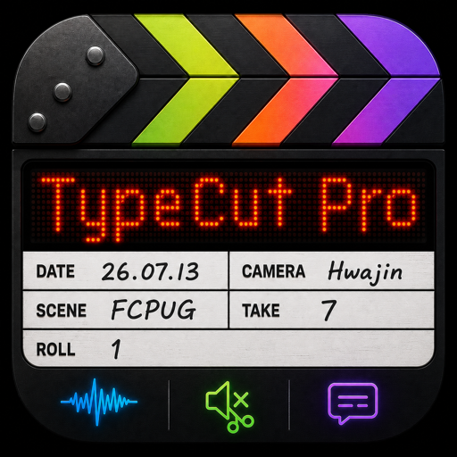
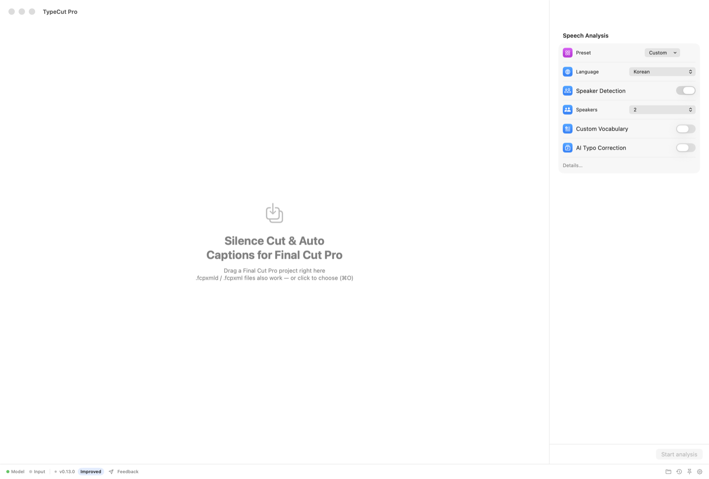
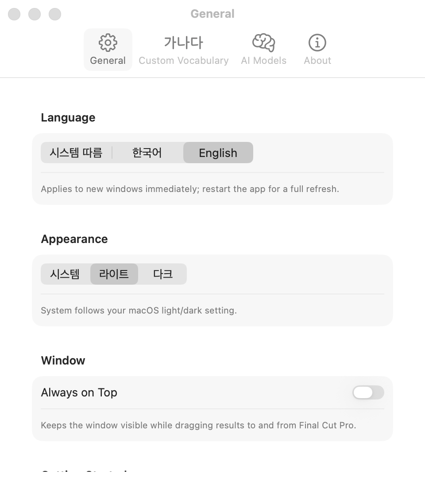
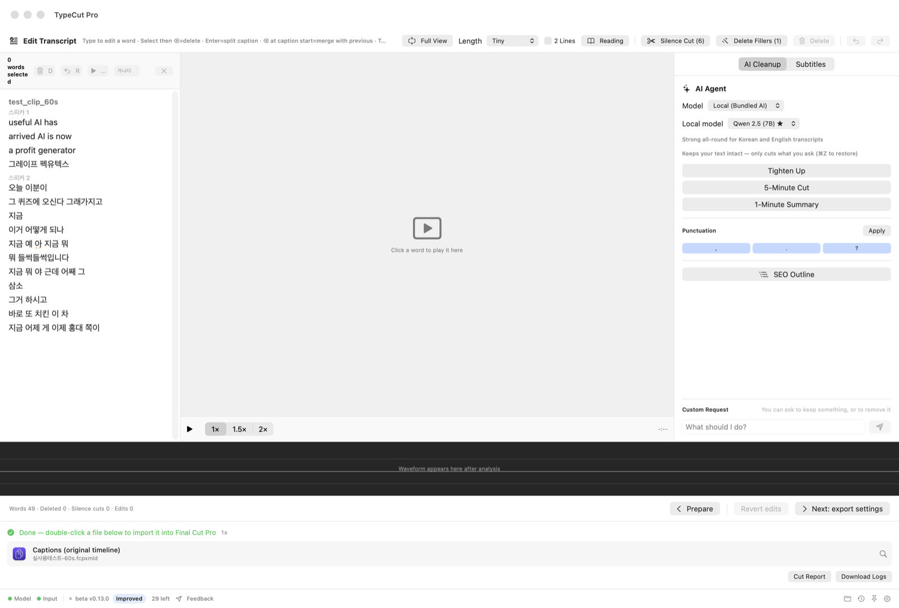
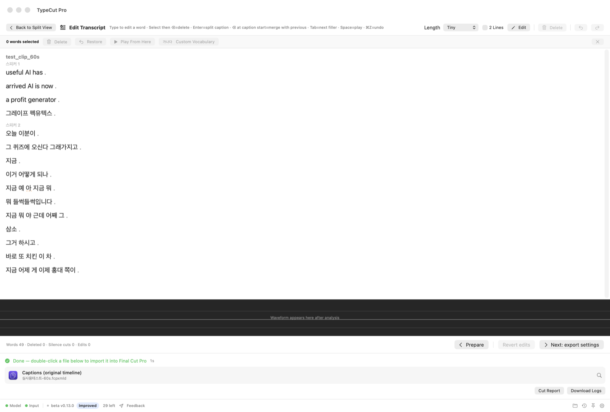
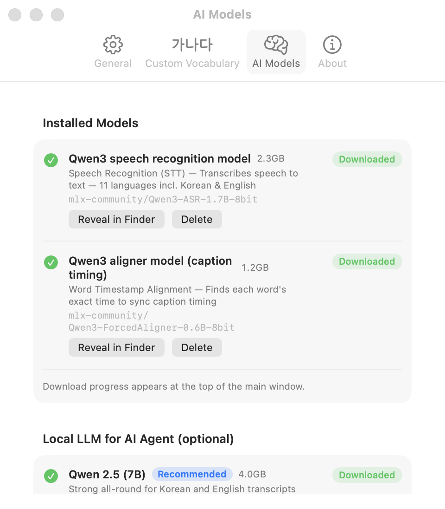
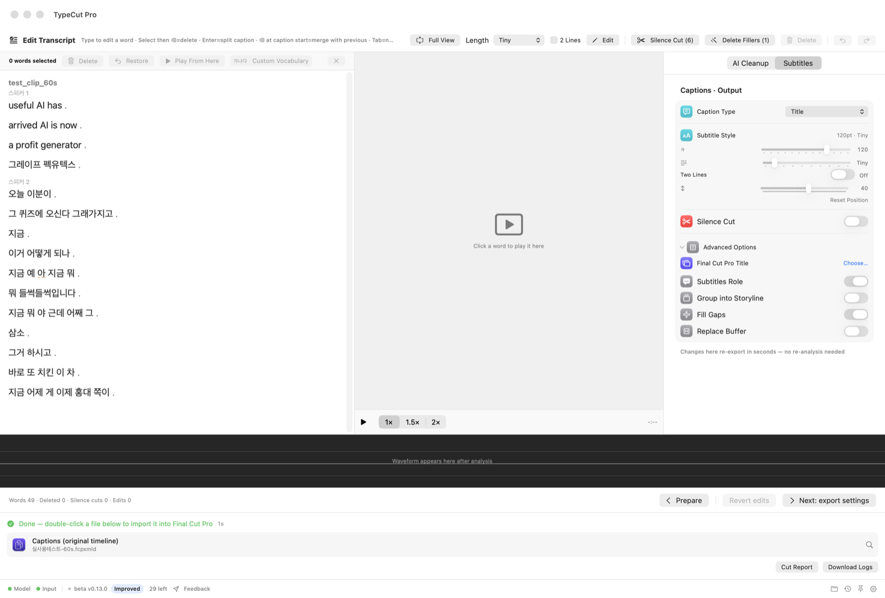
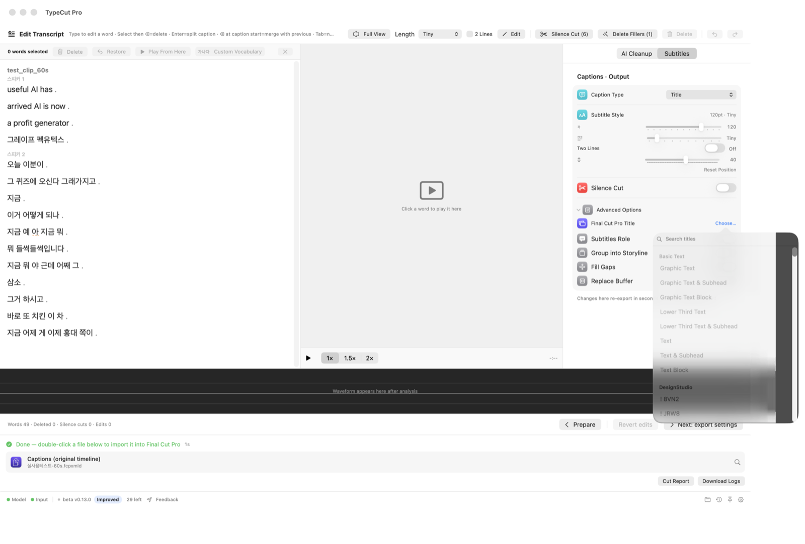
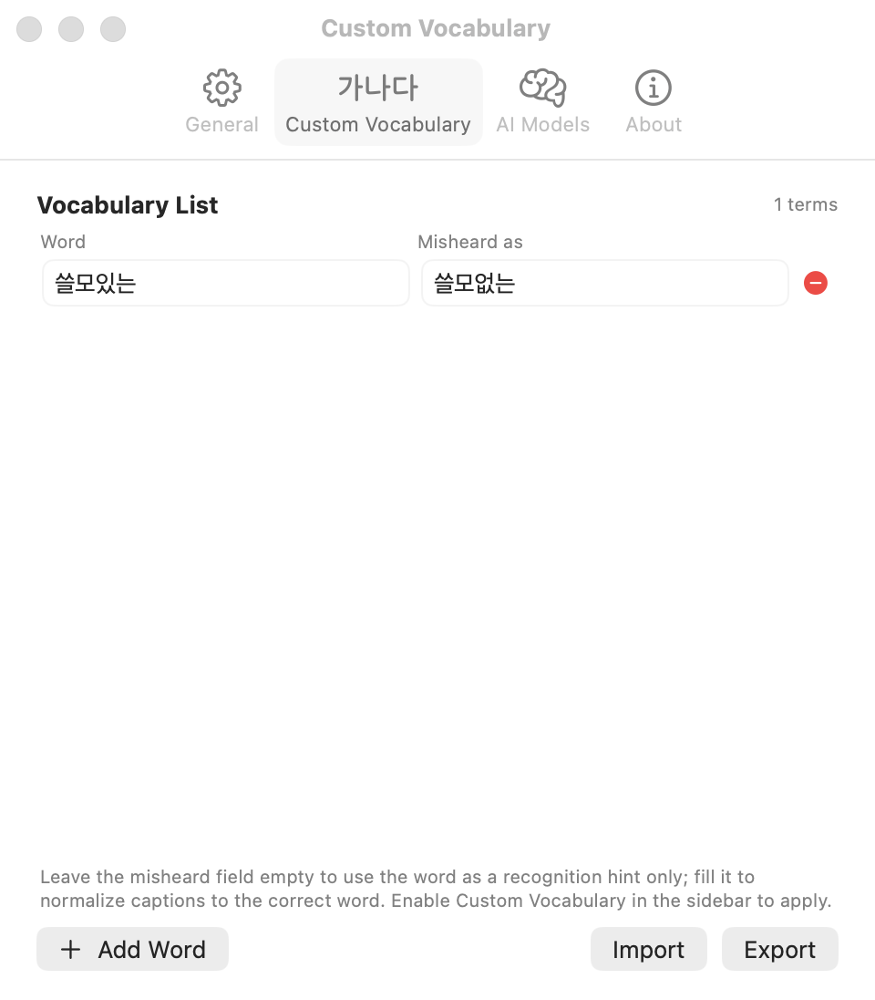
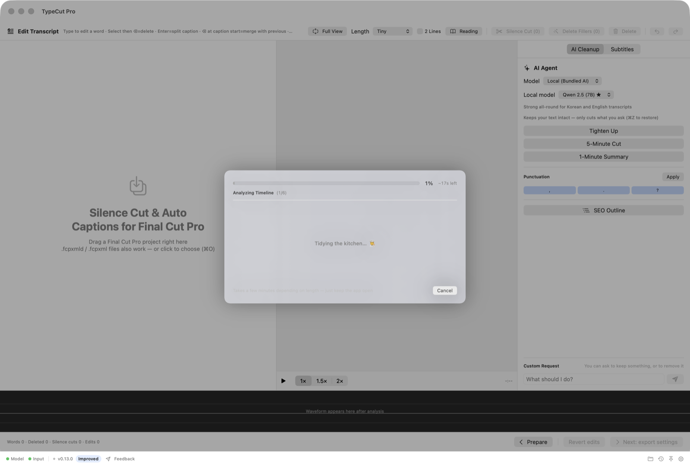

<a href="README.md">🇰🇷 한국어</a> · <a href="README.en.md">🇺🇸 English</a> · 🇯🇵 <b>日本語</b>

  

<h1 align="center">TypeCut Pro (beta)</h1>

  <b>タイピングするように、映像を編集する</b> 
  Edit Video as Fast as Typing

  <b>Final Cutのプロジェクトをドラッグすると — 文字起こしが開きます。</b>テキストを消せばその区間がカットされ、 
  字幕は自動で作られ、言葉の間の無音も自動で整理されます。結果は再びFinal Cut Proへ。 
  <b>映像・音声はあなたのMacの中だけで処理されます。</b>外部サーバーには送信されません。

  📢 <b>FCP AutoCutはTypeCut Proになりました</b> — 名前が変わっただけで、機能・設定・プロジェクトはそのままです。

  
  
  
  
  
  
  

  
   メイン画面 — 左のサイドバーで音声認識・字幕・出力オプションを選び、プロジェクトを点線ボックスにドロップするだけ。あまり使わないオプションは<b>詳細オプション（Advanced Options）</b>に折りたたまれています。

---

## こんな方に

インタビュー・講義・説教・ポッドキャスト・YouTubeなど、**話し言葉の多い長尺動画**をFinal Cut Proで編集している方。
話の合間の沈黙をひとつずつ切り取り、字幕を手入力し、不要な部分を選り分けていた時間を、
**TypeCut Proが肩代わりします。** 結果はいつでも**新しいプロジェクト**として返ってくるので、元のプロジェクトはそのままです。

## ダウンロード

👉 **[Releases](../../releases)** ページから最新のDMGを入手してください。インストール後は、**アプリ内の「今すぐアップデート」ボタン**で以降のバージョンをそのまま受け取れます。

> ℹ️ **アプリのUIは英語・韓国語対応です**（日本語UIはまだ対応していません）。このページのスクリーンショットはすべて英語UIの画面です。

| 動作環境 | |
|---|---|
| Mac | **Apple Silicon（M1以降）** — Intel Macは非対応 |
| macOS | 14（Sonoma）以降 |
| Final Cut Pro | 11.1.1・12.2〜12.3で動作確認済み（その他の10.x〜12.xは未確認または条件付き） |
| ディスク | 初回にAI音声モデル約**3.5GB**をダウンロード（オプション機能は追加ダウンロード） |

> 💬 **質問・バグ報告・機能リクエスト** — [GitHub Issue](../../issues)へどうぞ！

---

## なぜTypeCut Proなのか

- **⚡ 書き出しの手間がありません** — 他のツールでは音声認識のために**動画をレンダリングしたり、音声を別途抽出**して読み込ませる必要があります。TypeCut Proならその工程がまるごと不要です。**編集中のプロジェクトをそのままドラッグ**すれば、カット編集済みタイムラインの音声をそのまま解析し、**字幕生成からText-Based Editing（テキストベース編集）まで**そのまま進めます。
- **🔒 映像はあなたのMacの中に** — 音声認識・字幕生成・編集は基本的にオンデバイスで動作します。映像・音声が外部に出ることはなく、AIエージェントをクラウドモデルに自分で設定した場合だけ文字起こしテキストが送信されます。
- **♻️ 完全非破壊** — 結果は必ず**新しいプロジェクト**として出力されます。アジャストメントレイヤー・Bロール・セカンダリストーリーライン・カット構造はそのまま保持されます。
- **🎬 Final Cut Proにぴったり** — 字幕は最初から**FCPネイティブタイトル**として生成されるので差し替えは不要で、混合フレームレートでもずれません。
- **👀 見たままの結果** — アプリで見た字幕のサイズ・位置が、**Final Cut Proの実際のレンダリングと1:1で一致**します。
- **🌐 英語・韓国語** — アプリのUI・ログ・進行メッセージまで**英語と韓国語に完全対応**。設定 › 一般でいつでも切り替えられます（システムに従う / 韓国語 / English）。

  

---

## できること

### ✂️ 無音カット — 沈黙だけを取り除く

話と話の間の空白区間を自動で見つけて取り除きます。**カット強度（弱〜非常に強）**でどれだけ細かく切るかを選べ、それ以外の編集構造には触れません。元のタイムラインはそのままに、無音を取り除いた**短縮版**を別途作成します。

### 💬 字幕の自動化 — 話された通りに、正確に

- **ローカルAI音声認識（Qwen3-ASR）** と **単語レベルの精密タイミング（Forced Aligner）** で、発話にぴったり沿う字幕を作ります。
- **基本ストーリーライン（スパイン直下）のasset-clip・sync-clipのオーディオを解析** — 複数のソースファイルが混在する編集でも、クリップごとに自分のソースから音声を取得します。接続されたクリップ（レーン）やセカンダリストーリーラインは配置をそのまま保持しますが、音声解析の対象ではありません。
- **意味のまとまりで自然に分割** — 文全体を見て、最も読みやすいところで切ります。不自然な位置で文を分断しません。
- **句読点もルールに基づいて** — 疑問符は本当の質問にだけ、読点は実際に話が止まったところにだけ。明文化されたルール（句読点バイブル）に沿って動くので、結果に一貫性があります。
- **言語がぶれない** — 自動モードでは、英語の動画なら最初から最後まで英語の字幕に。区間ごとに言語が行ったり来たりしません。
- **音楽区間には字幕なし** — 音声ではない区間（BGM・効果音）で発生するハルシネーション字幕を、オーディオ解析で除外します。
- **韓国語・英語などの言語選択**、字幕形式（**タイトル / キャプション / 両方**）の選択が可能です。

### 📝 文字起こしエディタ — 動画を「文章」のように編集

解析が終わると、別ウィンドウなしで**同じ画面がそのまま文字起こしエディタ**に変わります。文字起こしを読みながら不要な部分を消すと、**その区間がタイムラインから切り落とされます**。元の文字起こしデータは書き換わらず、すべての編集は**⌘Zで元に戻せます**。

  
   文字起こしエディタ — 中央に<b>文字起こし</b>、右に<b>映像プレビュー</b>（字幕をリアルタイム表示）、下に<b>波形</b>、左に<b>AIエージェント</b>がひとつの画面に。

- **文書のように編集** — ドラッグで選択、クリックでその地点を再生、**ダブルクリックで単語をその場ですぐ修正**。文単位の段落で読みやすく、**可読性ビュー**（大きな文字）や**集中表示**（文字起こしのみの表示）に切り替えられます。
- **消すと切れる** — 削除した区間は編集版のタイムラインからカットされ、残った区間の字幕はそのまま維持されます。再生時に**削除区間は自動でスキップ**されます。
- **まとめて整理** — 「無音カット」「フィラー削除」ボタンで、文字起こし全体をワンクリックで整えられます。
- **プレビュー + 波形** — 隣で映像を字幕と一緒に確認し、下の波形をクリックするとその位置に移動。テキストも追従してスクロールします。カーソルを動かせばプレビュー・波形が追従し、**Spaceではカーソル位置から再生**します。
- **キーボードだけで** — 矢印キーでカーソルを自由に移動、deleteキーで連続削除（削除後もカーソルを維持）、ESCで編集を終了。

#### 💬 字幕ビュー — 字幕単位で整える（CapCutスタイル）

文字起こしではなく**字幕カード**で見たいときは、ツールバーから字幕ビューに切り替えてください。

  
   字幕ビュー — 番号・タイムコード付きの字幕カード。ツールバーで<b>字幕の長さ・2行</b>をすぐ調整できます。

- 実際に出力される**字幕1枚 = カード1枚**。番号が付いているので流れが一目で分かります。
- **字幕の先頭で⌫** — 前の字幕と結合。**⌘Enter** — カーソル位置で字幕を分割。矢印キーでカード間を移動できます。
- ツールバーの**字幕の長さメニュー + 2行チェックボックス**で、全体の字幕数をすぐ調整 — サイドバーの字幕スタイルと連動します。
- 結合・分割した境界は**出力結果にそのまま反映**されます。

### 🤖 AIエージェント — 頼めば代わりに編集

文字起こしエディタの左側にいるAIに、編集を任せられます。**要約や抜粋では文字起こしテキスト自体は変えず、必要な区間だけをカット**します（句読点の挿入など、テキストを編集する機能もあります）。結果はいつでも確認・元に戻せます。

- **要約 & 抜粋** — 「要点だけ整理」「5分に」「1分に」、あるいは*「売上の話だけ残して」*のように自由に指示。文ごとに重要度を付け、**要点から優先して**目標の長さに収めます。
- **Google SEO構造整理** — 文字起こし全体を**H2・H3見出し**に分けて**目次**を作成。目次から**セクションを丸ごと削除**して、素早く構成を固められます。
- **句読点を入れる** — 句点・疑問符・読点を**明文化されたルールに沿って**文に自動で挿入します。疑問符は本当の質問にだけ、読点は実際の発話の間にだけ — むやみに付けず、一貫した基準です。
- **デフォルトはオフライン** — バンドルされたローカルAIで動作します。より強力な結果が欲しければ、設定で**OpenAI・Gemini・Claude**のAPIキーを登録してクラウドモデルに切り替えられます（キーはこのMacのKeychainにのみ保存されます）。

  
   設定 › AIモデル — インストール済みの音声認識・アライメントモデルを確認・管理し、必要ならクラウドAPIキーを登録します。

### 🎨 字幕スタイル & タイトル — 最初から完成形

- **リアルタイムプレビュー** — 文字サイズ・字幕の長さ・**2行字幕**・位置（ドラッグ）を確認しながら調整。入力プロジェクトの**アスペクト比（16:9/9:16）を自動検出**してその比率で表示し、**9:16にはYouTube・Instagram・TikTokのセーフゾーンガイド**も表示されます。

  
   字幕スタイル — プレビューで見たサイズ・位置が<b>Final Cut Proの実際のレンダリングと1:1</b>。スライダーを動かせばすぐ反映されます。

- **差し替え不要のタイトル** — 他のツールの字幕は、FCPでタイトルを変えると長さがリセットされてタイムラインがずれることがあります。TypeCut Proは**希望のタイトルスタイルを最初からネイティブ値で生成**するので、その心配がありません。**FCP 12.3のSubtitleタイトル + Subtitlesロール**にも対応（一括選択・一括編集）。
- **自分のタイトルそのままに** — Final Cut Proのタイトルを**ドラッグして置くか、「選択」リストから選ぶ**と、字幕が**そのタイトルで**生成されます。Macにインストールされたタイトル（内蔵 + ユーザーインストール）を自動スキャンし、キャッシュでリストがすぐ開きます。

  
   Final Cutタイトル › 選択 — 内蔵タイトルから自分で入れたサードパーティタイトルまで、検索して選択できます。

- **混合フレームレートでも安心** — 30pプロジェクト + 29.97fpsソースのようにレートが違っても、字幕がメディアフレームに正確にそろいます（警告なし）。

### 🎚️ さらに磨きをかけたい場合

| オプション | すること |
|---|---|
| **話者分離** | 話者ごとに異なる色のロールを付与します（1つの字幕に2人の話者が混ざりません）。**話者数を自動/2・3・4人に固定**でき、実際より多く検出されるのを防ぎます。 |
| **高精度話者分離** | 発話が重なる対談・インタビュー向け。最新の重なり検出モデル（pyannote）で**同時発話区間まで話者別に**分離します（HuggingFaceトークンが必要。設定で登録）。 |
| **ストーリーラインで束ねる** | 字幕タイトルをバラバラではなく**接続されたストーリーライン1本**として出力 — タイムラインでまとめて動かせて管理しやすくなります。無音カット版にも適用されます。 |
| **フィラーカット** | 単独で飛び出す「えー」「あの」「うーん」系のつなぎ言葉や咳払いを除去。**弱/中/強**の強度で — 弱（純粋なフィラー）・中（+文中に挟まったフィラー）・強（+談話標識まで）。 |
| **固有名詞の校正** | よく間違う名前・ブランド・専門用語を登録して字幕表記をそろえます。適用前に**確認ウィンドウ**でチェックでき、辞書は**書き出し/読み込み**でバックアップ。**文字起こしエディタで単語を選んですぐ校正**することもできます。 |

  
   設定 › 固有名詞校正 — 正しい単語と誤認識されやすい発音を登録すると、字幕で自動的に統一されます。

---

## 使い方 — 3ステップ

1. **プロジェクトをドラッグ** — Final Cut Proでプロジェクトをつかみ、アプリの点線ボックスへ
2. **実行** — 必要なオプションをオンにして実行。進行状況と所要時間が表示されます
3. **受け取る** — 結果ファイルをFinal Cut Proへドラッグ → **新しいプロジェクトとして読み込む**（元のプロジェクトは非破壊）

  
   実行中 — 段階別の進行状況と<b>残り時間</b>が表示されます。動画のタイムコードも一緒に進みます。

  
   下部の結果バー — 画面を切り替えずにそのまま文字起こしの編集を続けたり、結果ファイルを<b>Final Cut Proにドラッグ</b>したりできます。オプションを変えて<b>再書き出し</b>（再解析なしで数秒）もここでできます。

> 結果は状況に応じて **① 元のタイムライン + 字幕**、**② 無音・編集で短くなったタイムライン + 字幕** になります。
> 処理したプロジェクトは**作業履歴（最大50件）**から結果フォルダをすぐ開けます。

## インストール & 初回起動

1. DMGを開き、**TypeCut Pro**を**Applicationsフォルダへ**ドラッグ
2. **セキュリティの解除（1回だけ）** — ベータ版はAppleの公証を受ける前のため、最初にmacOSがブロックします
   1. アプリをダブルクリック → 「開けません」という警告で**[OK]**
   2. **システム設定 → プライバシーとセキュリティ** → 下へスクロール
   3. 「"TypeCut Pro"はブロックされました」の横にある**[このまま開く]** → **[開く]** → Macのパスワードを入力
3. アプリの案内に従ってAI音声モデルを**[ダウンロード]**（初回1回、約3.5GB — 進行率は上部に表示）
4. **ディスクアクセス権限（1回だけ）** — メディアが外付けドライブ・NAS・ダウンロードフォルダにある場合は、オンボーディングの案内に従ってフルディスクアクセスをオンにしてください。**アプリをアップデートしても権限・モデルは維持されます。**

## パフォーマンス

- **字幕認識・精密タイミング**: 動画の長さに比例します（M1基準でおおよそ実時間の数倍速）
- **無音カット・字幕分割・フィラーカット・固有名詞校正**: ルールベースなので**即時**（モデル不要）
- **AIエージェント**（要約・SEO構造・句読点）: ローカルAIモデルを使うため、文字起こしの長さに応じて数秒〜数十秒（初回はモデルの読み込みでもう少し）
- 処理時間は下部の結果バーに**「所要時間」**として表示されます

## アップデート

新しいバージョンが出るとアプリ上部にバッジが表示されます。**「今すぐアップデート」**を押すと、アプリが最新版をダウンロードして自動で開きます — 開いたウィンドウでアプリをApplicationsへドラッグすれば完了です。

## プライバシー

- 音声認識・字幕・無音カット・文字起こし編集・**AIエージェント（デフォルトはローカルモデル）**など、**すべての処理があなたのMacで**行われます。
- 映像・音声ファイルが外部サーバーに送信されることはありません。
- ネットワークは**AIモデルの初回ダウンロード**、**アップデート確認**、そしてユーザー自身が押す**フィードバック送信・購入（App Store）**にのみ使われます。
- **例外（オプトイン）**: AIエージェントを**クラウドモデル（OpenAI/Gemini/Claude）に自分で設定**した場合だけ、そのとき**文字起こしテキスト**が選択したプロバイダーに送信されます（映像・音声は送信されません）。デフォルトのローカルモデルでは何も外部に出ません。

## フィードバック 🙏

アプリ下部の**[フィードバック]**ボタンからご意見をお送りください。エラーが起きた場合は、**[ログをダウンロード]**で保存したログを添えていただけると助かります。

- ベータ版は**30回**までご利用いただけます
- バージョンごとの変更点: [CHANGELOG.md](CHANGELOG.md)（韓国語）
- 環境・プロジェクト種別の互換性: [COMPATIBILITY.md](COMPATIBILITY.md)（韓国語）
